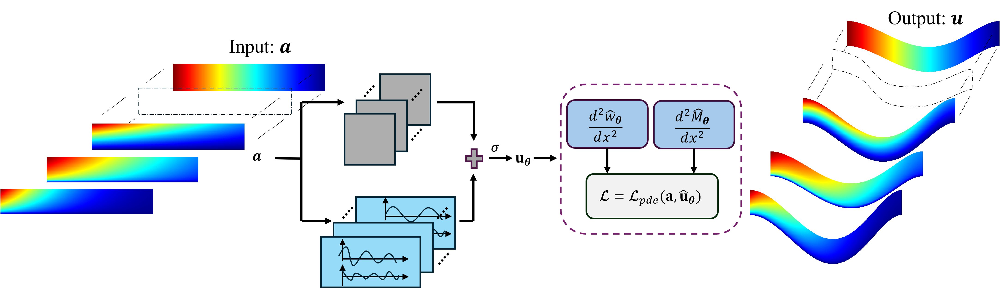
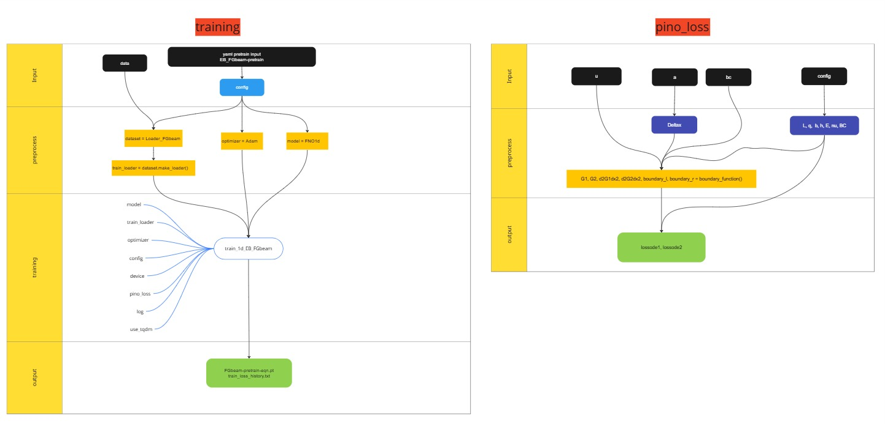

## Physics-informed Fourier neural operator for the bending analysis of bi-directional functionally graded beams with variable cross-sections
Abstract: *Neural operators have recently shown great potential for solving parametric partial differential equations (PDEs). However, their training process requires a large labeled input–output dataset, which is computationally expensive in engineering modeling. Consequently, physics-informed neural operators, which forego that requirement, have attracted significant attention. In this work, a physics-informed Fourier neural operator (PIFNO) is proposed for the bending analysis of bi-directional functionally graded (BDFG) beams with variable cross-sections. 
The problem is formulated as a boundary value problem with variable coefficients. These coefficients include the material and geometrical properties, while the beam's response is measured in terms of transverse displacement and bending moment.
PIFNO is designed to predict the beam’s response (output) given the coefficients (input). The input is characterized by the flexural stiffness, based on Euler–Bernoulli beam theory, and the output is approximated by a Fourier neural operator (FNO). In PIFNO, a non-dimensional form of the governing equations is introduced along with property scaling. Furthermore, the output is combined with boundary conditions to produce a new output that automatically satisfies these conditions. The loss function is defined using the finite difference method (FDM).
Numerical examples examine various types of material distributions and different forms of variable cross-sections under multiple boundary conditions. The results show that PIFNO can accurately predict the displacement and bending moment for various boundary conditions without requiring a labeled input–output dataset.*

 

## Architecture of the code


## Data description
Input instances are generated using the MATLAB code in folder "matlab_code/generate_input/".

All input configurations are set in the file "matlab_code/common/loadparameter_v2.m": 

- input_type = 'test';               % train and test and validate
- distribution_form = @powerlaw;     % @exponentiallaw; %@powerlaw;
- height_fun = @height_linear;       % profile of height function: @height_linear; @height_sin;
- material_fun = @materialcoeff;
- paramtype = 'bi';                  % two/three/four different parameters
- BC = 'CF';                         % CC, CS, SS, CF

### For a beam with a power-law distribution, the parameter α of the beam’s sectional height is fixed at α = 0.5.
The following data is used in Section 5.1 of the paper: 

* [EB_bi_1025_rng0_powerlaw_height_linear_data5_r06r06f05_train.mat](https://drive.google.com/file/d/1ZbXFUUWjBjaBSEPwO002Z9qTmt4MwmMa/view?usp=sharing)
* [EB_bi_1025_rng1_powerlaw_height_linear_data5_r06r06f05_test.mat](https://drive.google.com/file/d/1p7WcyPvCm84qgWPrPe_1mZu26Fr4bfix/view?usp=sharing)

Input instances for other configurations can be generated using the provided MATLAB code.

## Compile the code
### Train PIFNO
To train PIFNO for BDFG beams, run:
```bash 
python3 train_EB_FGbeam.py --config_path configs/pretrain/EB_FGbeam-pretrain.yaml --mode train
```

To test PIFNO for BDFG beams, run:
```bash
python3 train_EB_FGbeam.py --config_path configs/test/EB_FGbeam.yaml --mode test
```

## Closed-form solution
The closed-form solution is provided in "matalb_code/closed_form_solution/main_analytical_solution.m"

## Citation
If you think that the work of the PIFNO is useful in your research, please consider citing our paper in your manuscript:
```
@article{trung2025,
  title={Physics-informed Fourier neural operator for the bending analysis of bi-directional functionally graded beams with variable cross-sections},
  author={Duy-Trung Vo, Jaehong Lee},
  journal={European Journal of Mechanics A/Solids},
  volume={},
  pages={},
  year={2025},
  publisher={Elsevier}
}