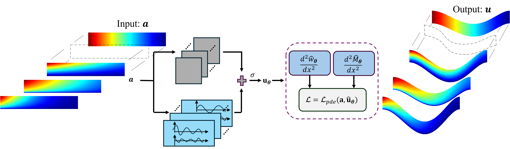
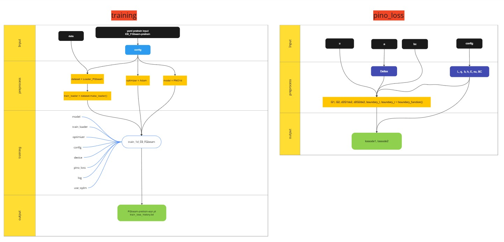

## Physics-informed Fourier neural operator for the bending analysis of bi-directional functionally graded beams with variable cross-sections
Abstract: *Neural operators have recently shown great potential for solving parametric partial differential equations (PDEs). However, their training process requires a large labeled input–output dataset, which is computationally expensive in engineering modeling. Consequently, physics-informed neural operators, which forego that requirement, have attracted significant attention. In this work, a physics-informed Fourier neural operator (PIFNO) is proposed for the bending analysis of bi-directional functionally graded (BDFG) beams with variable cross-sections. 
The problem is formulated as a boundary value problem with variable coefficients. These coefficients include the material and geometrical properties, while the beam's response is measured in terms of transverse displacement and bending moment.
PIFNO is designed to predict the beam’s response (output) given the coefficients (input). The input is characterized by the flexural stiffness, based on Euler–Bernoulli beam theory, and the output is approximated by a Fourier neural operator (FNO). In PIFNO, a non-dimensional form of the governing equations is introduced along with property scaling. Furthermore, the output is combined with boundary conditions to produce a new output that automatically satisfies these conditions. The loss function is defined using the finite difference method (FDM).
Numerical examples examine various types of material distributions and different forms of variable cross-sections under multiple boundary conditions. The results show that PIFNO can accurately predict the displacement and bending moment for various boundary conditions without requiring a labeled input–output dataset.*



## Code Architecture
The following diagram shows the overall workflow of the PIFNO implementation:


## Data Description
Training and test data are generated using MATLAB code located in:  
`matlab_code/generate_input/`

Input parameters can be configured in:  
`matlab_code/common/loadparameter_v2.m` 

Key parameters:

```matlab
input_type = 'test';               % Options: 'train', 'test', or 'validate'
distribution_form = @powerlaw;    % Options: @powerlaw, @exponentiallaw
height_fun = @height_linear;      % Options: @height_linear, @height_sin
material_fun = @materialcoeff;
paramtype = 'bi';                 % Options: 'bi', 'tri', 'quad'
BC = 'CF';                        % Boundary conditions: 'CC', 'CS', 'SS', 'CF'
```

### Data Used in Section 5.1 of the Paper  

For a beam with a power-law distribution and α = 0.5:

- Train Data: [EB_bi_1025_rng0_powerlaw_height_linear_data5_r06r06f05_train.mat](https://drive.google.com/file/d/1ZbXFUUWjBjaBSEPwO002Z9qTmt4MwmMa/view?usp=sharing)  
- Test Data: [EB_bi_1025_rng1_powerlaw_height_linear_data5_r06r06f05_test.mat](https://drive.google.com/file/d/1p7WcyPvCm84qgWPrPe_1mZu26Fr4bfix/view?usp=sharing)

You can generate data for other configurations using the provided MATLAB code.

## Running the Code
### Training
To train PIFNO model for BDFG beams:
```bash 
python3 train_EB_FGbeam.py --config_path configs/pretrain/EB_FGbeam-pretrain.yaml --mode train
```

### Testing
To evaluate the trained model:
```bash
python3 train_EB_FGbeam.py --config_path configs/test/EB_FGbeam.yaml --mode test
```

## Closed-Form Solution
The closed-form solution is provided in: 
`matlab_code/closed_form_solution/main_analytical_solution.m`

## Citation
If you find this work useful for your research, please consider citing the following paper:
```
@article{VO2025105798,
title = {Physics-informed Fourier neural operator for the bending analysis of bi-directional functionally graded beams with variable cross-sections},
journal = {European Journal of Mechanics - A/Solids},
pages = {105798},
year = {2025},
issn = {0997-7538},
doi = {https://doi.org/10.1016/j.euromechsol.2025.105798},
url = {https://www.sciencedirect.com/science/article/pii/S0997753825002323},
author = {Duy-Trung Vo and Jaehong Lee},
keywords = {Machine learning, Neural operator, Fourier neural operator, Physics-informed approach, Bi-directional functionally graded beam},
}